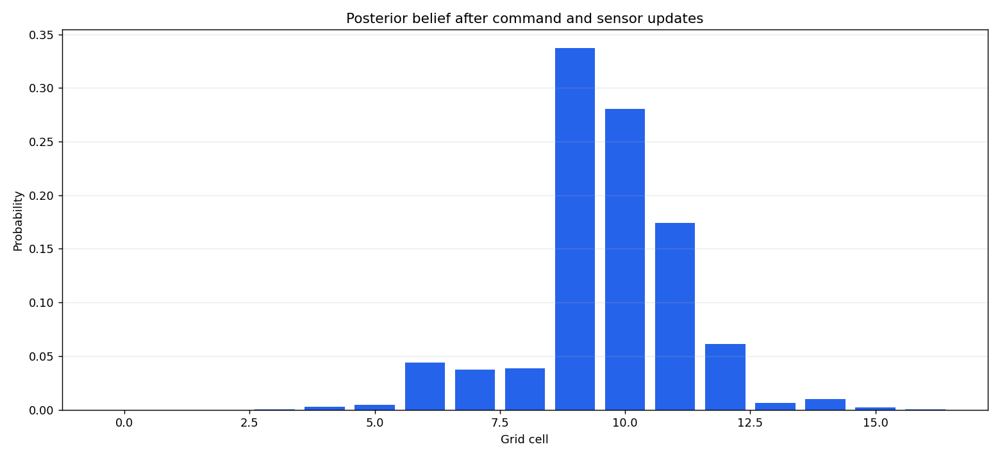

# 1D Bayes Filter

Discrete Bayes filtering for a robot moving through a 17-cell one-dimensional grid world. The implementation includes:

- a probabilistic forward/backward motion model with boundary handling
- a binary floor-color sensor model
- recursive belief updates for known or unknown initial position

## Run

```bash
python - <<'PY'
import numpy as np
import ex1

belief = np.zeros(17)
belief[7] = 1.0
world = np.loadtxt("world.data", delimiter=",", dtype=int)
observations = np.loadtxt("observations.data", delimiter=",", dtype=int)

final_belief = ex1.recursive_bayes_filter(list("FFFFBBFFB"), observations, belief, world)
print("most likely cell:", np.argmax(final_belief))
print("probability:", final_belief.max())
PY
```

## Result screenshots



Posterior belief distribution after the recursive command and sensor update sequence.


## What this demonstrates

- Discrete Bayes filtering with a motion model and binary sensor likelihood.
- Belief-state propagation over a compact 1D world.
- Readable probabilistic robotics code that exposes each update step.


## Limitations and next steps

- The world is one-dimensional and intentionally simplified.
- The binary sensor model does not capture richer perception ambiguity.
- Next steps: add step-by-step belief animation and tests for boundary cases.

